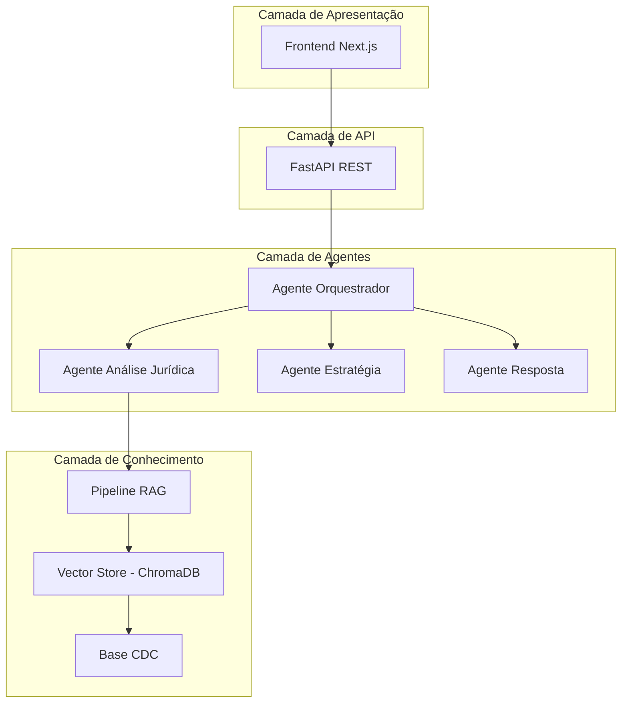
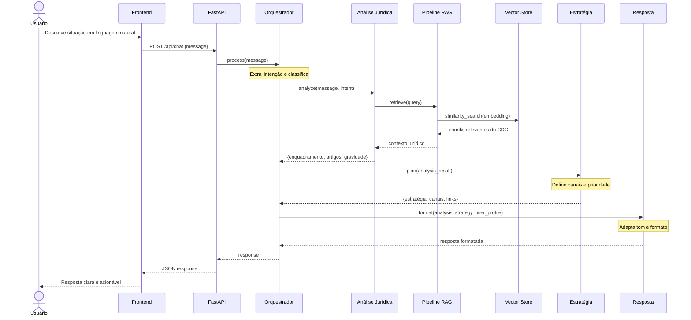
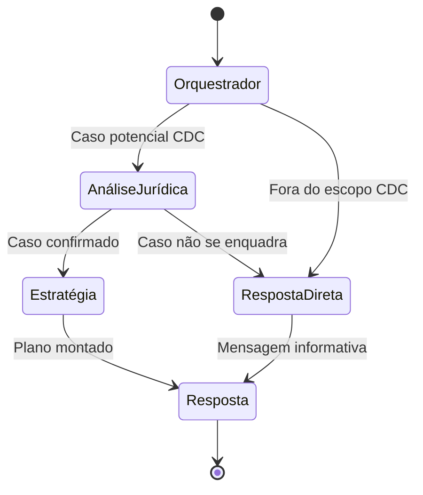
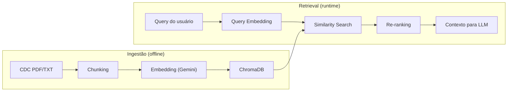
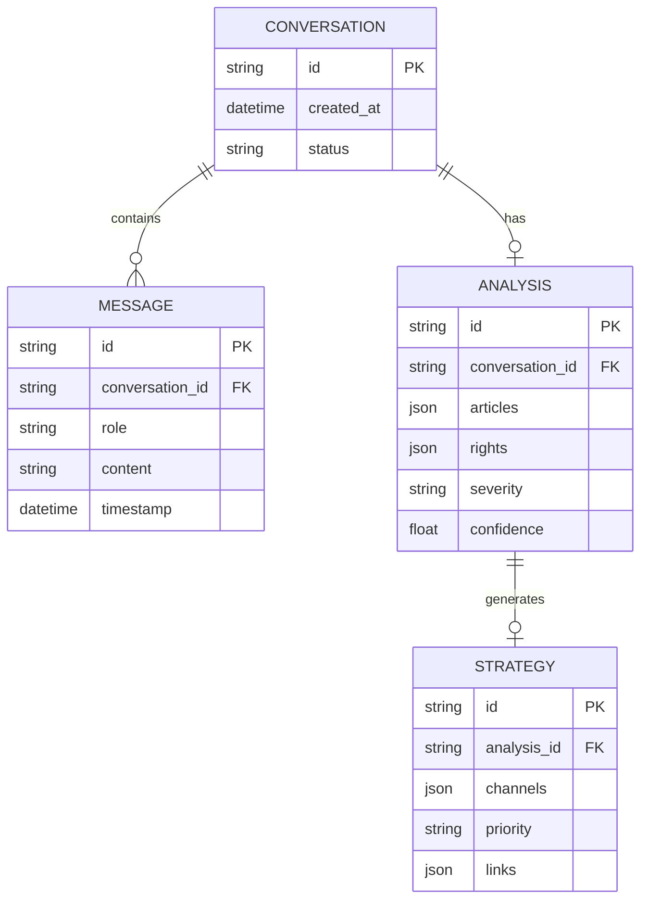
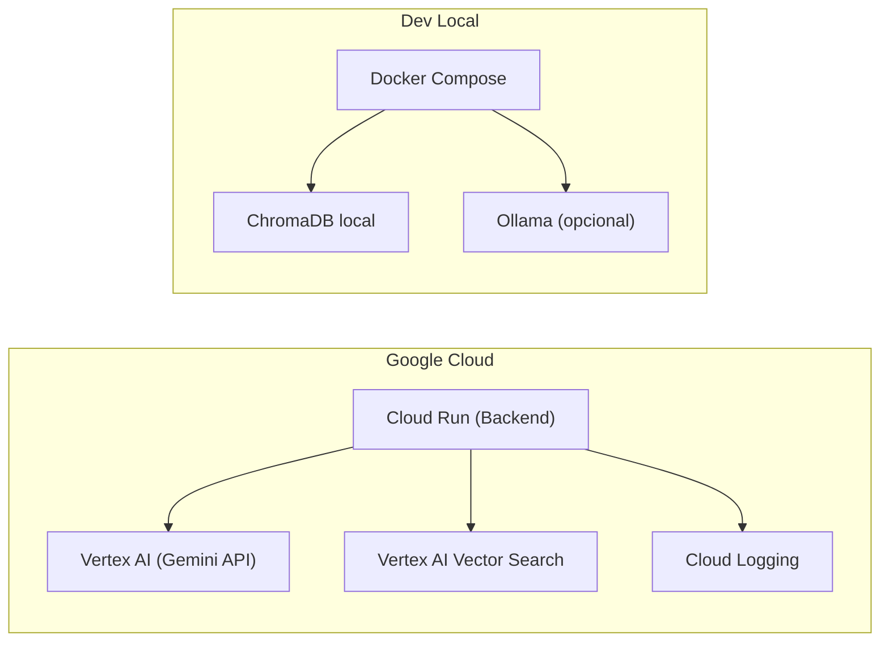

# Arquitetura do Resolve Aí 🏗️

> Documentação detalhada da arquitetura do sistema com diagramas e justificativas técnicas.

---

## 1. Visão Geral da Arquitetura

O Resolve Aí segue uma arquitetura de **multi-agentes orquestrados** com **RAG (Retrieval-Augmented Generation)**. O sistema é composto por 4 camadas principais:



---

## 2. Fluxo de Processamento Completo



---

## 3. Grafo de Estados dos Agentes (LangGraph)

O LangGraph modela o fluxo como um **grafo de estados** (StateGraph), onde cada nó é um agente e as transições são condicionais:



### State Schema (LangGraph)

```python
from typing import TypedDict, Literal, Optional
from langgraph.graph import StateGraph

class ResolveAiState(TypedDict):
    # Input
    user_message: str

    # Orquestrador
    intent: str
    is_cdc_case: bool

    # Análise Jurídica
    legal_analysis: Optional[dict]  # {articles: [], rights: [], severity: str}
    rag_context: Optional[list]     # chunks recuperados

    # Estratégia
    strategy: Optional[dict]        # {channels: [], priority: str, links: []}

    # Resposta
    final_response: str
    response_metadata: dict         # {tokens_used, latency, sources}
```

> 💡 **Dica de Sênior:** Use `TypedDict` ao invés de `dict` genérico para o state do LangGraph. Isso dá autocompletion no IDE, valida os tipos em runtime (com mypy) e torna o código auto-documentado.

---

## 4. Pipeline RAG Detalhado



### Estratégia de Chunking

| Parâmetro | Valor Sugerido | Justificativa |
|-----------|:--------------:|---------------|
| **Método** | Recursive Text Splitter | Respeita estrutura do texto jurídico |
| **Chunk Size** | 800 tokens | Balanceia contexto vs. custo |
| **Overlap** | 200 tokens | Evita perda de informação nas bordas |
| **Metadata** | Artigo, Capítulo, Seção | Permite filtragem por artigo específico |

> 💡 **Dica de Sênior:** O CDC tem uma estrutura muito clara (Títulos → Capítulos → Seções → Artigos). Use essa hierarquia como metadata nos chunks. Isso permite retrieval mais preciso: se o modelo identifica "cobrança indevida", pode filtrar diretamente pelo Capítulo V (Das Práticas Comerciais).

### Embedding Model

| Opção | Modelo | Dimensão | Uso |
|-------|--------|:--------:|-----|
| **Dev (local)** | `all-MiniLM-L6-v2` | 384 | Desenvolvimento rápido, gratuito |
| **Prod (Gemini)** | `text-embedding-004` | 768 | Melhor qualidade, custo baixo |

---

## 5. Detalhamento dos Agentes

### 5.1 Agente Orquestrador

**Responsabilidade:** Receber a mensagem do usuário, classificar a intenção e rotear para o agente correto.

```python
# Pseudocódigo do nó orquestrador
def orchestrator_node(state: ResolveAiState) -> ResolveAiState:
    """
    Classifica a intenção do usuário:
    - 'consumer_complaint': caso potencial de CDC
    - 'general_question': dúvida geral sobre CDC
    - 'out_of_scope': fora do escopo
    """
    intent = classify_intent(state["user_message"])
    return {
        **state,
        "intent": intent,
        "is_cdc_case": intent in ["consumer_complaint", "general_question"]
    }
```

### 5.2 Agente de Análise Jurídica

**Responsabilidade:** Consultar o RAG, identificar artigos aplicáveis e avaliar enquadramento.

**Prompt template (resumido):**
```
Você é um especialista em Direito do Consumidor brasileiro.
Analise a situação descrita e determine:
1. Se se enquadra no CDC (Lei 8.078/1990)
2. Quais artigos são aplicáveis
3. Quais direitos o consumidor possui
4. A gravidade do caso (baixa, média, alta)

Contexto jurídico (CDC):
{rag_context}

Situação do consumidor:
{user_message}
```

### 5.3 Agente de Estratégia

**Responsabilidade:** Montar um plano de ação com canais priorizados.

**Lógica de priorização:**
```
SE gravidade == "alta" E empresa == "reincidente":
    → Sugerir PROCON direto + JEC como backup
SE gravidade == "baixa":
    → Sugerir contato direto + consumidor.gov.br como backup
SENÃO:
    → Escada padrão (SAC → Ouvidoria → consumidor.gov.br → PROCON → JEC)
```

### 5.4 Agente de Resposta

**Responsabilidade:** Formatar a resposta final de forma clara, acessível e acionável.

**Princípios de formatação:**
- Linguagem simples (evitar "juridiquês")
- Links diretos e clicáveis
- Passos numerados e concretos
- Tom empático ("Entendemos sua frustração...")

---

## 6. Modelo de Dados



> 💡 **Dica de Sênior (MVP):** Para o MVP, **não use banco de dados**. Use um dicionário em memória ou até mesmo stateless (cada request é independente). Só adicione persistência quando tiver histórico de conversas (Fase 2). Overengineering no MVP é o maior assassino de projetos.

---

## 7. API — Endpoints Principais (MVP)

```
POST /api/chat
  Body: { "message": "string" }
  Response: { "response": "string", "analysis": {...}, "sources": [...] }

GET /api/health
  Response: { "status": "ok", "version": "0.1.0" }
```

> Spec completa da API em [MVP_SPEC.md](./MVP_SPEC.md)

---

## 8. Deploy (Google Cloud)



> 💡 **Dica de Sênior:** Desenvolva com ChromaDB local e Ollama. Deploy com Gemini + Vertex AI Vector Search. Use variáveis de ambiente para trocar entre ambientes: `LLM_PROVIDER=ollama|gemini` e `VECTOR_STORE=chroma|vertex`. Essa abstração é trivial de implementar e demonstra maturidade de engenharia.

---

## 9. Considerações de Segurança (MVP)

- **Rate limiting** na API (5 req/min por IP no MVP)
- **Sanitização de input** para evitar prompt injection
- **CORS** configurado para o domínio do frontend
- **Sem dados pessoais** armazenados no MVP (stateless)
- **Disclaimer legal** visível na interface

---

*Documento vivo — atualizar conforme o projeto evolui.*
